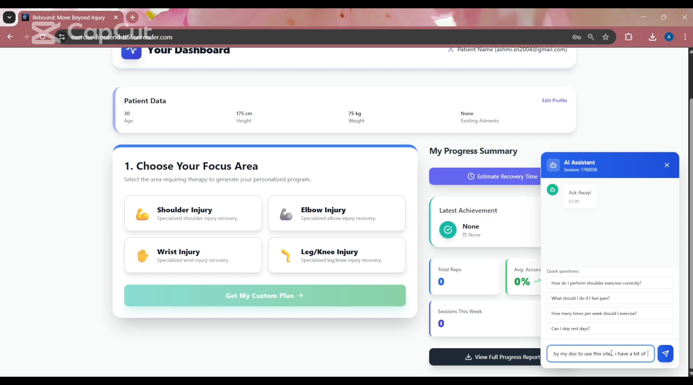
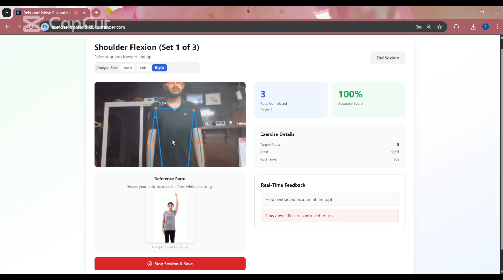
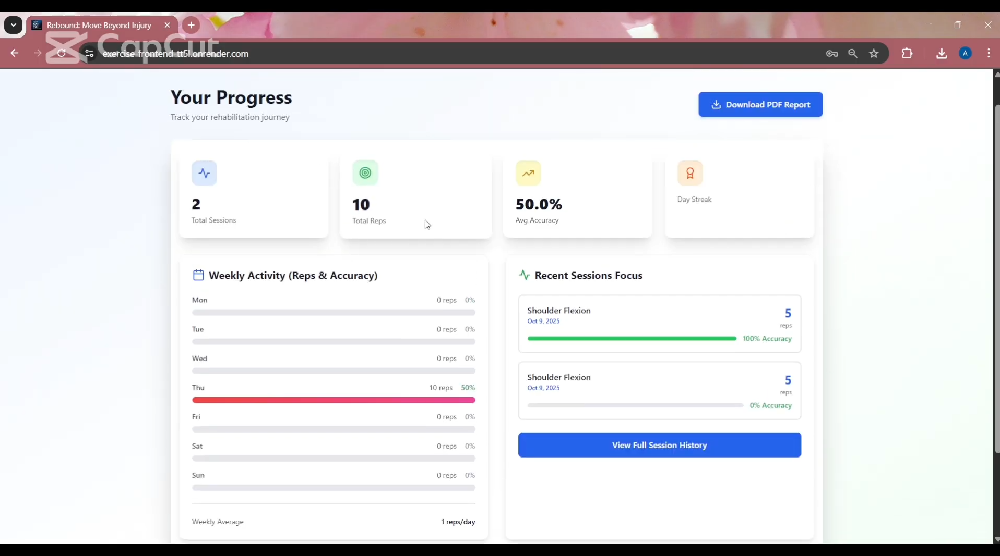
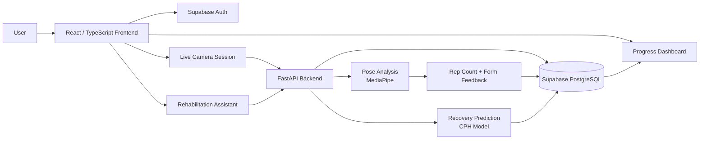

# REBOUND — AI Physiotherapy & Rehabilitation Platform

<p align="center">
  <strong>Real-time exercise tracking, rehabilitation monitoring, and personalized recovery insights.</strong><br />
  Pose estimation · PostgreSQL · FastAPI · Recovery prediction
</p>

REBOUND is an AI-assisted rehabilitation platform that tracks physiotherapy exercises through a live camera feed, provides real-time form feedback, records workout sessions, and visualizes recovery progress over time.

**Tech stack:** `React` · `TypeScript` · `FastAPI` · `Python` · `MediaPipe` · `Supabase` · `PostgreSQL` · `Gemini` · `Tailwind CSS`

## Demo / Screenshots

<!-- Add a deployed application or product video link here. -->

| Home + assistant | Live exercise session |
| --- | --- |
|  |  |



The repository also includes the brand mark in [`Rebound_cropped.png`](Rebound_cropped.png). The current captures demonstrate the home experience, live pose feedback, progress analytics, and the in-product assistant; the recovery predictor is available in the application but does not have a separate provided capture.

## Architecture



The frontend uses Supabase Auth for authentication. Camera frames, session writes, progress reads, recovery prediction, and assistant requests go through FastAPI. MediaPipe performs pose analysis, while the serialized Cox proportional hazards model returns a median recovery-time estimate.

See [`docs/architecture.md`](docs/architecture.md) for the full request flow.

## Features

### Real-time exercise tracking

REBOUND analyzes exercise movements from a webcam or mobile camera using MediaPipe pose landmarks. The tracking pipeline provides:

- repetition counting with movement-state transitions and debounce timing
- joint-angle and range-of-motion analysis
- partial/full repetition feedback
- live visual and audio guidance
- per-session accuracy scores

The backend currently contains analysis configurations for shoulder, elbow, knee, ankle, and wrist movements.

### Personalized rehabilitation plans

Users choose a rehabilitation need and receive a structured exercise plan with target repetitions, sets, rest periods, difficulty, and program duration. Plans are currently defined for shoulder, elbow, wrist, and leg/knee injuries.

### Recovery prediction

The FastAPI backend exposes a Cox proportional hazards model that estimates median recovery time from patient and injury features. See [`docs/recovery-model.md`](docs/recovery-model.md) for the feature contract and limitations.

### Progress tracking

Completed sessions are persisted in Supabase PostgreSQL and aggregated by the backend into:

- total sessions and repetitions
- weighted average accuracy
- weekly activity by day
- recent session history
- inferred treated ailment from performed exercises

The database shape and the queries behind these metrics are documented in [`sql/schema.sql`](sql/schema.sql), [`sql/analytics.sql`](sql/analytics.sql), and [`docs/database.md`](docs/database.md).

### Authentication and assistant

Supabase Auth provides email/password registration and login. The rehabilitation assistant is backed by Gemini through FastAPI and maintains an in-memory chat session per assistant session ID.

## Data flow

```text
Camera frame
    ↓
MediaPipe pose landmarks
    ↓
Joint-angle and exercise-state logic
    ↓
Rep count + form feedback
    ↓
Session record
    ↓
Supabase PostgreSQL
    ↓
Progress and recovery analytics
```

## Data & Analytics

REBOUND stores one row per completed rehabilitation session in Supabase PostgreSQL.

The SQL layer includes queries for:

- total sessions and repetitions
- repetition-weighted accuracy
- exercise-level session and repetition totals
- weekly activity and active days
- consecutive-day streaks
- returning-user and 7-day return rates

The current schema intentionally remains session-grained; event-level motion data and recovery predictions are not persisted.

[`sql/schema.sql`](sql/schema.sql) · [`sql/analytics.sql`](sql/analytics.sql) · [`docs/database.md`](docs/database.md)

## API

| Endpoint | Purpose |
| --- | --- |
| `GET /` | Backend health check |
| `POST /api/auth/signup` | Create a Supabase Auth user |
| `POST /api/auth/signin` | Authenticate a user |
| `POST /api/get_plan` | Generate an exercise plan for an ailment |
| `POST /api/analyze_frame` | Analyze one camera frame and return updated tracking state |
| `POST /api/save_session` | Persist completed exercise-session metrics |
| `GET /api/progress/{user_id}` | Retrieve aggregated progress and recent sessions |
| `POST /api/predict_recovery` | Estimate median recovery days with the CPH model |
| `POST /api/chat` | Send a message to the rehabilitation assistant |
| `GET /api/pdf/{user_id}` | Generate a progress report PDF |

Interactive FastAPI documentation is available at `http://localhost:8000/docs` when the backend is running.

## Example exercise pipeline

For shoulder flexion, the backend selects the more visible side and measures the angle between the hip, shoulder, and elbow.

```text
Frame
  ↓
Pose landmarks
  ↓
Shoulder angle
  ↓
Calibration + movement state
  ↓
Rep completed?
  ↓
Feedback + session update
```

Calibration is performed from the user's observed movement range. A repetition is only added after the state transitions through the movement and returns to the starting range; debounce timing prevents rapid duplicate counts.

## Run locally

### 1. Configure environment variables

Copy `.env.example` to `.env` and fill in the Supabase credentials. The frontend reads the `VITE_` variables; the backend also reads them for its Supabase client and requires `GEMINI_API_KEY` for assistant responses.

```bash
cp .env.example .env
```

Never commit `.env` or other files containing secrets.

### 2. Start the frontend

```bash
npm install
npm run dev
```

The frontend runs at `http://localhost:5173`.

### 3. Start the backend

```bash
cd backend
python3 -m venv .venv
source .venv/bin/activate
pip install -r requirements.txt
python main.py
```

The API runs at `http://localhost:8000`.

## Repository structure

```text
.
├── backend/
│   ├── main.py
│   ├── model/
│   │   ├── cph_model.joblib
│   │   └── model_features.json
│   └── requirements.txt
├── docs/
│   ├── architecture.md
│   ├── database.md
│   ├── evaluation.md
│   ├── recovery-model.md
│   └── screenshots/README.md
├── images/
│   ├── home-dashboard.png
│   ├── live-exercise-session.png
│   └── progress-dashboard.png
├── public/
│   └── audio/
├── sql/
│   ├── schema.sql
│   ├── seed.sql
│   ├── analytics.sql
│   └── README.md
├── src/
│   ├── components/
│   ├── contexts/
│   ├── lib/
│   └── pages/
├── .env.example
└── README.md
```

## Evaluation

The CV pipeline needs a repeatable benchmark before production claims are made. [`docs/evaluation.md`](docs/evaluation.md) defines the proposed protocol for rep-count accuracy, range/form classification, latency, and failure cases.

## Limitations

REBOUND is a prototype for rehabilitation monitoring and experimentation. Pose measurements depend on camera angle, lighting, visibility, and landmark quality. The recovery model is loaded from a serialized artifact and its training dataset, calibration, and validation metrics are not currently included in this repository.

The reminders screen currently stores state in the frontend session rather than a persisted database table. REBOUND is not a medical device and should not replace assessment or treatment by a qualified healthcare professional.
