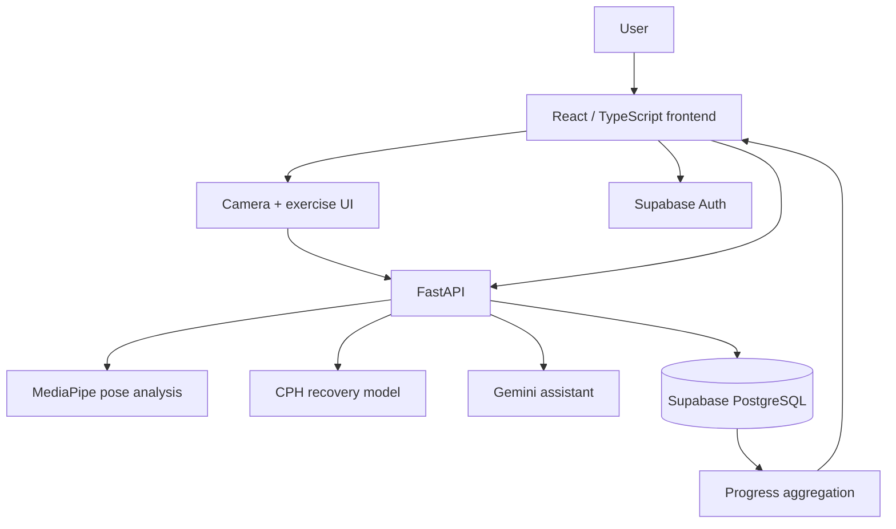
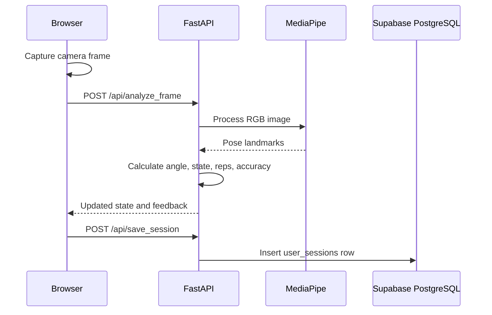

# REBOUND architecture

## Runtime components

| Component | Responsibility | Source |
| --- | --- | --- |
| React/Vite frontend | Authenticated product UI, camera capture, progress views, reminders UI | `src/` |
| Supabase Auth | Email/password registration, login, and browser session state | `src/contexts/AuthContext.tsx` |
| FastAPI API | Plans, pose analysis, session writes, progress aggregation, PDF, chat, prediction | `backend/main.py` |
| MediaPipe Pose | 33-landmark pose estimation for incoming frames | `backend/main.py` |
| Supabase PostgreSQL | Durable user-session records and source data for analytics | `backend/main.py` |
| CPH model | Median recovery-time prediction from patient/injury features | `backend/model/` |
| Gemini | Conversational rehabilitation assistant | `backend/main.py` |

## System architecture



### Responsibility boundaries

- **Client:** authentication state, camera permissions and capture, live tracking display, feedback/audio presentation, recovery form, progress UI, and the in-memory reminders UI.
- **FastAPI:** request validation, exercise-plan lookup, MediaPipe inference, movement-state transitions, rep/accuracy calculation, session persistence, progress aggregation, PDF generation, recovery prediction, and Gemini chat orchestration.
- **Supabase/Auth:** email/password identity and browser session state. PostgreSQL stores completed `user_sessions` rows consumed by the backend analytics.
- **CV pipeline:** MediaPipe returns landmarks; the backend selects a visible side, calculates exercise-specific joint angles, calibrates observed range, applies state/debounce logic, and returns feedback.
- **ML model:** the backend constructs the ordered feature frame and calls `predict_median`; predictions are not persisted in the current implementation.

## Live-session request flow



The frontend keeps the current tracking state between frames and sends it as `previous_state`. The backend returns a new state containing the rep count, movement stage, calibrated range, frame count, partial-rep buffer, and selected analysis side.

## Recovery-prediction flow

```text
Recovery Predictor form
    ↓ POST /api/predict_recovery
PredictionInput validation
    ↓
Feature frame built in MODEL_FEATURES order
    ↓
cph_model.joblib.predict_median(...)
    ↓
median_recovery_days
```

The model endpoint returns an estimate; it does not persist a prediction record in the current implementation.

## Deployment notes

The frontend can be served by Vite or a static host. The backend is configured for Render through `backend/render.yaml`; its working directory must be `backend/` so the relative model path `model/cph_model.joblib` resolves correctly.
