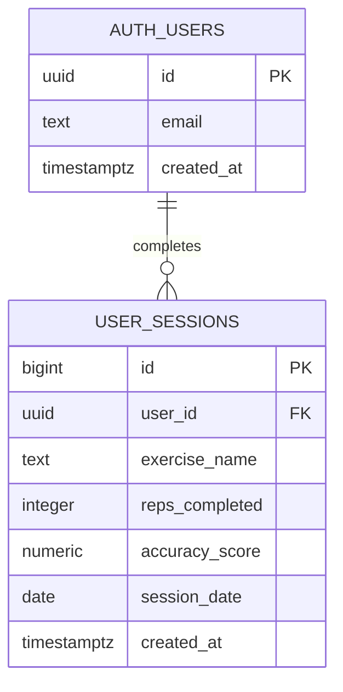

# REBOUND database

REBOUND currently persists completed workout sessions in Supabase PostgreSQL. Supabase Auth owns the user identity table; the application does not currently create a separate profile table. The backend also attempts to read a `users` relation for an email address, so a deployment should provide a safe profile view/table or remove that lookup when Row Level Security does not permit it. That relation is an existing deployment dependency, not a table invented by this repository documentation.

## Entity relationship diagram

## `user_sessions` contract

`POST /api/save_session` inserts these fields:

| Column | Type | Notes |
| --- | --- | --- |
| `user_id` | UUID | Supabase Auth user ID |
| `exercise_name` | TEXT | Name returned by the exercise plan |
| `reps_completed` | INTEGER | Full reps completed; partial reps are accumulated by the tracker |
| `accuracy_score` | NUMERIC | Final frame/session score on a 0–100 scale |
| `session_date` | DATE | Date generated by the API |

The progress endpoint also reads `created_at`, which should have a database default such as `now()`.

The reviewable schema and RLS migration are maintained in [`sql/schema.sql`](../sql/schema.sql). Optional local/demo data guidance is in [`sql/seed.sql`](../sql/seed.sql); no fabricated user or health records are committed.

## Data boundary

The current session record is intentionally small. Duration, raw feedback history, target reps, and model predictions are represented in frontend types or responses but are not currently written by `/api/save_session`. Add those columns only together with an explicit migration and updated RLS policies.

## Data grain and progress calculation

Each successful call to `/api/save_session` creates one `user_sessions` row for one completed exercise session. There is no `exercise_events` table in the current implementation, so progress aggregation does not join session rows to event rows and cannot accidentally multiply session-level values through an event join.

`GET /api/progress/{user_id}` reads the user's sessions, calculates total sessions and repetitions, computes repetition-weighted accuracy, groups activity by weekday from `created_at`, and returns the five most recent sessions. The reference SQL in [`sql/analytics.sql`](../sql/analytics.sql) mirrors these supported metrics and labels unsupported metrics explicitly.
